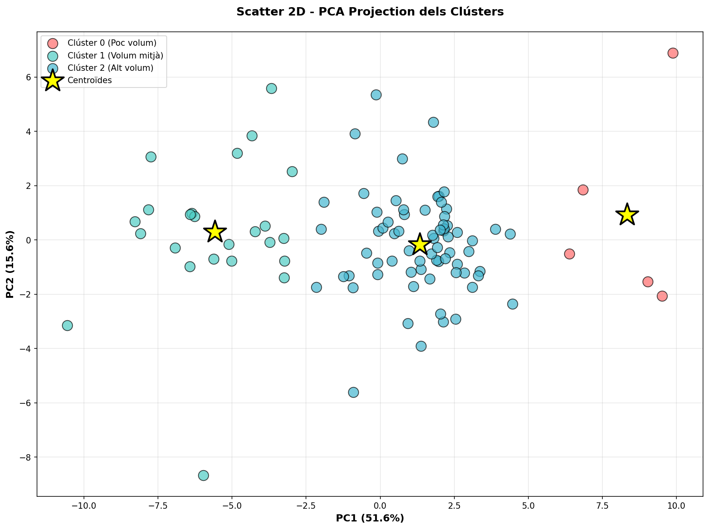
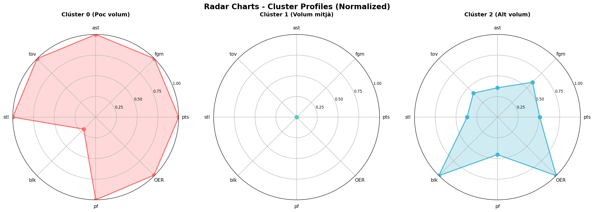
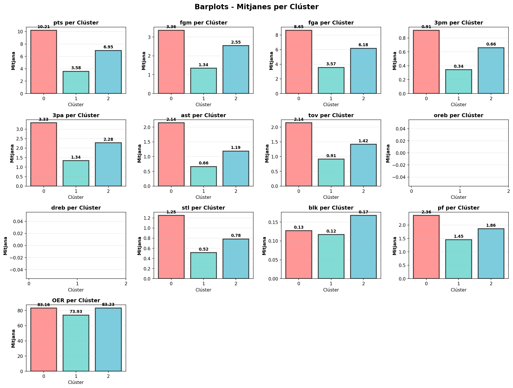
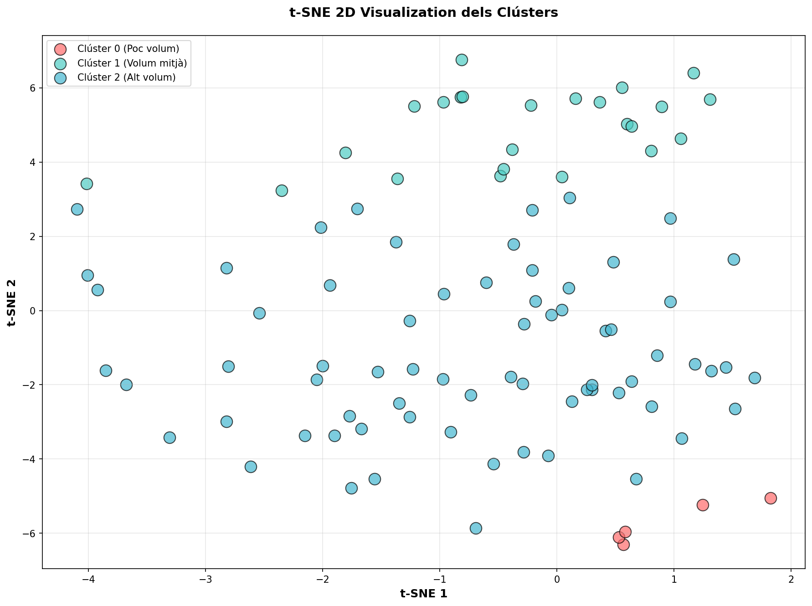

# 🏀 FEB Basketball Clustering Analysis

Anàlisi de clustering de jugadors de bàsquet de la Federació Espanyola de Bàsquet (FEB) utilitzant tècniques de Machine Learning no supervisat. Identificació de perfils de jugadors basats en estadístiques de rendiment per aplicacions de scouting i tàctica.

[](https://www.python.org/)
[](https://scikit-learn.org/)
[](https://www.mongodb.com/atlas)
[](LICENSE)

## 📊 Resum del Projecte

Aquest projecte aplica **K-Means clustering** per segmentar 98 jugadors de la FEB en 3 grups basats en 30 features d'estadístiques de rendiment. L'anàlisi identifica **3 perfils clarament diferenciats**:

- **Clúster 0 - Elite/Stars** (5 jugadors, 5.1%): Màxim volum ofensiu i eficiència
- **Clúster 1 - Role Players** (24 jugadors, 24.5%): Baix volum, rol limitat
- **Clúster 2 - Regulars** (69 jugadors, 70.4%): Volum mitjà-alt, balancejats

**Silhouette Score**: 0.4206 (clusters moderadament definits amb sentit esportiu)

---

## 🎯 Objectius

1. **ETL/EDA**: Extreure i processar dades de MongoDB Atlas amb ~109K partits FEB
2. **Feature Engineering**: Crear estadístiques avançades (OER, possessions, eficiència per zona)
3. **Clustering**: Aplicar K-Means (k=3) i DBSCAN per identificar perfils de jugadors
4. **Visualització**: Generar 8+ visualitzacions (PCA, t-SNE, radar charts, heatmaps)
5. **Interpretació**: Aplicacions pràctiques per scouting, tàctica i planificació de plantilla

---

## 📁 Estructura del Projecte

```
FEB-Basketball-Clustering/
├── data/                          # Datasets processats i models
│   ├── players_clustering_original.csv      # 98 jugadors × 70 features
│   ├── players_clustering_scaled.csv        # Features normalitzades
│   ├── clustering_results_final.csv         # Assignacions de clústers
│   ├── clustering_summary_table.csv         # Mitjanes per clúster
│   ├── clustering_representative_players.csv # Top 3 jugadors per clúster
│   └── models/
│       ├── scaler_clustering.pkl            # StandardScaler entrenat
│       └── model_summary.txt                # Documentació del model
│
├── notebooks/                     # Jupyter Notebooks d'anàlisi
│   ├── 01_connexio_mongo.ipynb              # Part 1: ETL/EDA (MongoDB → CSV)
│   ├── 02_clustering_kmeans_dbscan.ipynb    # Part 2: K-Means + DBSCAN
│   └── 03_visualitzacions.ipynb             # Part 3: Visualitzacions + Conclusions
│
├── visualizations/                # Gràfics generats
│   ├── distribution_plots.png               # Histogrames + KDE (13 variables)
│   ├── boxplots_outliers.png                # Boxplots amb outliers (IQR)
│   ├── correlation_heatmap_full.png         # Matriu correlació 68×68
│   ├── correlation_heatmap_key.png          # Matriu correlació 13×13
│   ├── scatter_2d_pca.png                   # PCA 2D (67.2% variança)
│   ├── tsne_2d.png                          # t-SNE 2D visualization
│   ├── barplots_cluster_means.png           # Comparativa mitjanes per clúster
│   └── radar_charts_profiles.png            # Perfils normalitzats (8 dimensions)
│
├── src/                           # Scripts Python
├── docs/                          # Documentació
├── requirements.txt               # Dependències Python
├── LLISTAT DE TASQUES DEL PROJECTE.txt      # Checklist del projecte
└── README.md                      # Aquest fitxer
```

---

## 🚀 Instal·lació i Execució

### Prerequisits

- Python 3.13+
- MongoDB Atlas account (o instància local)
- Git

### 1. Clonar el repositori

```bash
git clone https://github.com/jmiralles2004/FEB-Basketball-Clustering.git
cd FEB-Basketball-Clustering
```

### 2. Crear entorn virtual i instal·lar dependències

```bash
python -m venv .venv
.venv\Scripts\activate  # Windows
# source .venv/bin/activate  # Linux/Mac

pip install -r requirements.txt
```

### 3. Configurar MongoDB

Crear fitxer `.env` amb les credencials de MongoDB Atlas:

```env
MONGO_URI=mongodb+srv://<user>:<password>@<cluster>.mongodb.net/
MONGO_DB=feb_db
```

### 4. Executar notebooks

```bash
jupyter notebook
```

Obrir i executar en ordre:
1. `01_connexio_mongo.ipynb` - ETL/EDA (extreu dades de MongoDB)
2. `02_clustering_kmeans_dbscan.ipynb` - Entrenament del model
3. `03_visualitzacions.ipynb` - Visualitzacions i conclusions

---

## 📈 Resultats Clau

### Clústers Identificats

| Clúster | Jugadors | % | PTS | AST | TOV | OER | Perfil |
|---------|----------|---|-----|-----|-----|-----|--------|
| **0 - Elite** | 5 | 5.1% | 10.21 | 2.14 | 2.14 | 83.16 | Alt volum, creadors de joc |
| **1 - Role Players** | 24 | 24.5% | 3.58 | 0.66 | 0.91 | 73.93 | Baix volum, suplents |
| **2 - Regulars** | 69 | 70.4% | 6.95 | 1.19 | 1.42 | 83.23 | Volum mitjà, balancejats |

### Validació del Model

- **Silhouette Score**: 0.4206 (separació moderada però coherent)
- **PCA**: 67.2% variança explicada amb 2 components (PC1: 51.6%, PC2: 15.6%)
- **t-SNE**: Separació clara dels 3 clústers en espai 2D
- **DBSCAN**: Detecta patrons similars (2 clústers + 28 outliers amb eps=3.5)

### Visualitzacions Destacades

<details>
<summary>📊 Visualitzacions (click per expandir)</summary>

#### PCA 2D Projection


#### Radar Charts - Cluster Profiles


#### Barplots - Cluster Means


#### t-SNE 2D Visualization


</details>

---

## 🎓 Metodologia

### Part 1: ETL/EDA (30%)

- **Connexió MongoDB**: ~109K partits de 3 temporades FEB
- **Agregació**: Mitjanes per jugador (98 jugadors amb >10 partits)
- **Feature Engineering**: 
  - Possessions = FGA + 0.4×FTA + TOV
  - OER = (PTS / Possessions) × 100
  - Defensive Contribution = STL + BLK
  - Percentatges de tir 2P/3P per zones
- **Neteja**: Filtrat de jugadors amb <10 partits, tractament d'outliers (IQR)
- **Normalització**: StandardScaler per 30 features

### Part 2: Machine Learning (40%)

- **K-Means**: 
  - Determinació de k òptim (Elbow, Silhouette, Calinski-Harabasz)
  - k=3 seleccionat (Silhouette: 0.4206)
  - Assignació de clústers i interpretació esportiva
- **DBSCAN** (opcional):
  - Paràmetres òptims: eps=3.5, min_samples=5
  - Detecta 2 clústers + 28 outliers
  - Comparativa amb K-Means
- **Validació**: Taula de mitjanes, jugadors representatius, sentit esportiu

### Part 3: Visualització i Conclusions (30%)

- **Descriptives**: Distribucions, boxplots, correlacions (8 gràfics)
- **Clustering**: PCA, t-SNE, barplots, radar charts (4 gràfics)
- **Interpretació**: Perfils esportius, aplicacions tàctiques, limitacions, millores

---

## 💡 Aplicacions Pràctiques

### 🎯 Scouting & Reclutament
- Identificar jugadors sub-valorats dins Clúster 2
- Detectar potencial d'ascens de Role Players → Regulars
- Comparar jugadors similars entre equips rivals

### ⚽ Tàctica & Estratègia
- **vs Élite (Clúster 0)**: Doble equip, falta tàctica, pressió alta
- **vs Role Players (Clúster 1)**: Jugar amb iniciativa, ritme alt
- **vs Regulars (Clúster 2)**: Defensa equilibrada, ritme variable

### 📊 Planificació de Plantilla
- **Balanceig òptim**: 5% elite + 25% role players + 70% regulars
- **Profunditat**: Mínim 2-3 jugadors d'elit per competitivitat
- **Versatilitat**: Role players amb múltiples especialitats defensives

---

## ⚠️ Limitacions

1. **Agregació global**: No captura variacions temporals (forma, lesions)
2. **Features limitades**: Falta dades defensives avançades, dades físiques
3. **Valors nuls**: Rebots ofensiu/defensiu no disponibles (100% nuls)
4. **Distribució desequilibrada**: 70% jugadors en Clúster 2
5. **Mostra petita**: 98 jugadors per 30 features (ratio 1:3.3, ideal 1:10)
6. **Validació temporal**: Sense validació creuada inter-temporada

---

## 🔮 Millores Futures

### Curt Termini
- [ ] Clustering per posició (PG, SG, SF, PF, C)
- [ ] Filtrar per jugadors amb >500 minuts
- [ ] Validació: coherència de clústers per equips

### Mitjà Termini
- [ ] Integrar dades defensives de SPA/tracking
- [ ] Clustering temporal: per quarters/períodes de temporada
- [ ] Afegir dades morfològiques (altura, pes, edat)

### Llarg Termini
- [ ] **Web scraping** de FEB per dades biogràfiques
- [ ] Shooting maps per zona (court_region)
- [ ] Clustering jeràrquic per sub-perfils
- [ ] Predictions d'evolució de carrera

---

## 🛠️ Tecnologies Utilitzades

- **Python 3.13**: Llenguatge principal
- **MongoDB Atlas**: Base de dades NoSQL (~109K documents)
- **Pandas 2.3.3**: Manipulació de dades
- **NumPy 2.4.1**: Operacions numèriques
- **scikit-learn 1.8.0**: K-Means, DBSCAN, PCA, t-SNE, StandardScaler
- **Matplotlib & Seaborn**: Visualitzacions
- **Jupyter Notebook**: Entorn d'anàlisi interactiu

---

## 📚 Referències

- [K-Means Clustering - scikit-learn](https://scikit-learn.org/stable/modules/clustering.html#k-means)
- [DBSCAN - scikit-learn](https://scikit-learn.org/stable/modules/clustering.html#dbscan)
- [Basketball Reference](https://www.basketball-reference.com/) - Referència d'estadístiques
- [FEB - Federació Espanyola de Bàsquet](https://www.feb.es/)

---

## 👤 Autor

**Josep Miralles**
- GitHub: [@jmiralles2004](https://github.com/jmiralles2004)
- Repositori: [FEB-Basketball-Clustering](https://github.com/jmiralles2004/FEB-Basketball-Clustering)

---

## 📄 Llicència

Aquest projecte està sota la llicència MIT. Consulta el fitxer [LICENSE](LICENSE) per més detalls.

---

## 🙏 Agraïments

- Federació Espanyola de Bàsquet (FEB) per les dades
- MongoDB Atlas per la infraestructura de base de dades
- scikit-learn per les implementacions d'algoritmes de clustering

---

**⭐ Si aquest projecte t'ha estat útil, no dubtis en donar-li una estrella al repositori!**
